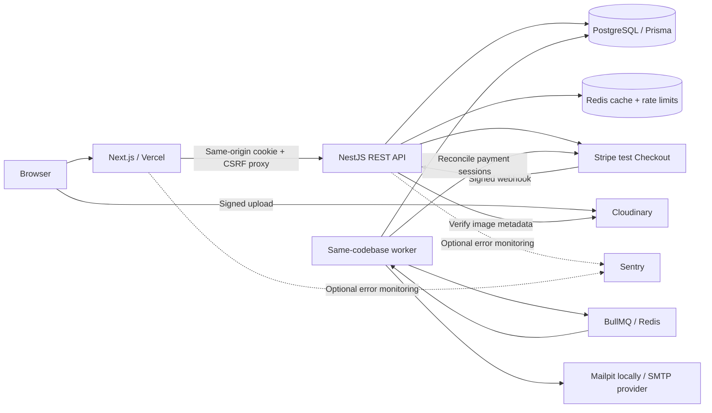
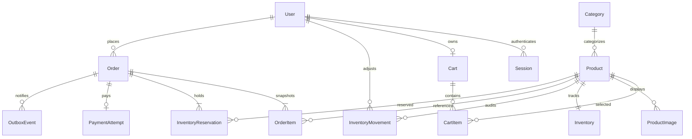

# Architecture and invariants

CommerceCore is a pnpm monorepo containing Next.js and a NestJS modular monolith.
PostgreSQL is the source of truth. Redis holds disposable catalog responses and
BullMQ jobs; durable notification intent remains in PostgreSQL.

## Module boundaries

Controllers handle HTTP contracts and validation. Services implement workflows;
repositories own catalog/cart/order data access. Payment and notification services
own their transactional workflows directly where splitting them into trivial
repositories would hide the transaction boundary. Adapters isolate external APIs.
Next.js never writes database records or trusts browser-supplied prices.

The worker shares models and services with the API. Running it independently lets
slow work avoid request latency; this is still one deployment codebase and database,
not a microservice architecture. PostgreSQL, Redis and Mailpit retain the Phase 1
Docker Compose setup.

## Data relationships

WebhookEvent independently records processed provider event IDs. CatalogRevision
is a singleton revision used in Redis cache keys. Money uses integer USD cents;
PostgreSQL CHECK constraints enforce amounts, quantities and stock bounds. Product
archival preserves order references. Session tokens are hashed; passwords use scrypt.

## Checkout and payment

1. Catalog browsing can hit Redis; cart reads always calculate current database prices.
2. Checkout compares and increments the customer's cart version inside a transaction.
3. Product share locks stabilize price/status snapshots. Inventory rows update in
   sorted product-ID order with `onHand - reserved >= quantity` in the UPDATE itself.
4. The transaction creates the order/items/reservations, empties the cart, and bumps
   the catalog revision. Any failure rolls back all effects.
5. A unique user/idempotency-key pair plus canonical request hash makes retries safe.
6. PaymentAttempt persists stable Stripe parameters before a network call. Provider
   idempotency recovers ambiguous responses without creating a second session.
7. Signed webhooks fetch current Stripe state, validate identity/amount/currency,
   lock the order, and atomically consume or release reservations and deduplicate
   the event. Paid orders also create an OutboxEvent in that same transaction.
8. The worker dispatches durable notifications, sends email with retries, and
   reconciles expired holds. Uncertain provider state retains stock for review/retry.

The order state machine allows pending ? paid ? fulfilled, or pending ? expired.
CANCELLED is reserved in the schema for a future explicit cancellation workflow;
there is currently no customer cancellation/refund endpoint.

## Consistency and recovery

- Database constraints maintain `0 <= reserved <= onHand` even under concurrency.
- Cache revisions commit with mutations; stale Redis keys expire in 60 seconds.
- Cache failure falls back to PostgreSQL; rate-limit failure blocks sensitive writes.
- Outbox events survive Redis loss. Email delivery is at least once, not exactly once.
- Webhook retries roll back their deduplication record when processing fails.
- Stripe attempts lacking a session ID after 23 hours require manual review rather
  than risking a new session after provider idempotency-key retention expires.

## Scaling path

Keep this design until measured load justifies changes. Add connection-pool tuning,
query analysis, cursor pagination and catalog read replicas before splitting services.
The global catalog revision deliberately favors simplicity over high write throughput.
A startup can later partition invalidation by category/product if metrics justify it.
