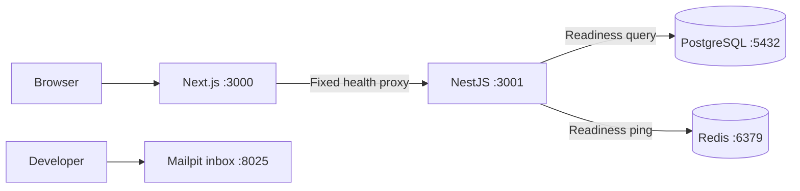

# Phase 1 architecture

CommerceCore is one pnpm workspace containing a Next.js frontend and a NestJS modular
monolith. PostgreSQL is the future system of record. Redis will support caching and
background processing. Mailpit captures development email when notifications are added.

## Boundaries

- NestJS owns future business logic and database access.
- Next.js owns presentation; its current API route only forwards a fixed health check.
- Controllers own HTTP contracts, services orchestrate behavior, and infrastructure
  providers own external connections.
- There is no shared domain package yet. Extract shared code only when there is a real use.
- The Prisma schema remains empty until Phase 2. No database mutation is performed at startup.

## Local runtime

Run the web/API development servers on the host for hot reload. Docker Compose runs
PostgreSQL, Redis, and Mailpit. Database and Redis use named persistent volumes; Mailpit
messages are disposable. Connection URLs use `localhost` because the apps run on the host.
If apps later run in containers, their connection hostnames must use Compose service names.

Redis uses append-only persistence and `noeviction`, preparing it for future BullMQ use.
Queue/cache consumers, job workers, and cache policy are deliberately deferred.

## Configuration and tests

Environment configuration fails fast for malformed settings. Health endpoints distinguish
process liveness from dependency readiness and redact failure details. Dependency outages
do not prevent the HTTP process from starting.

CI tests API routing and failure responses with controlled dependencies, then runs a separate
integration test using real PostgreSQL and Redis. A production build never requires a live API
or database: the home page is static, and health requests happen at request time.

## Next phase

Introduce actual catalog models, migrations, Prisma client/adapter wiring, and catalog UI/API
incrementally. Auth, inventory transactions, payments, notifications, cloud deployment, and
monitoring integrations remain later phases.
